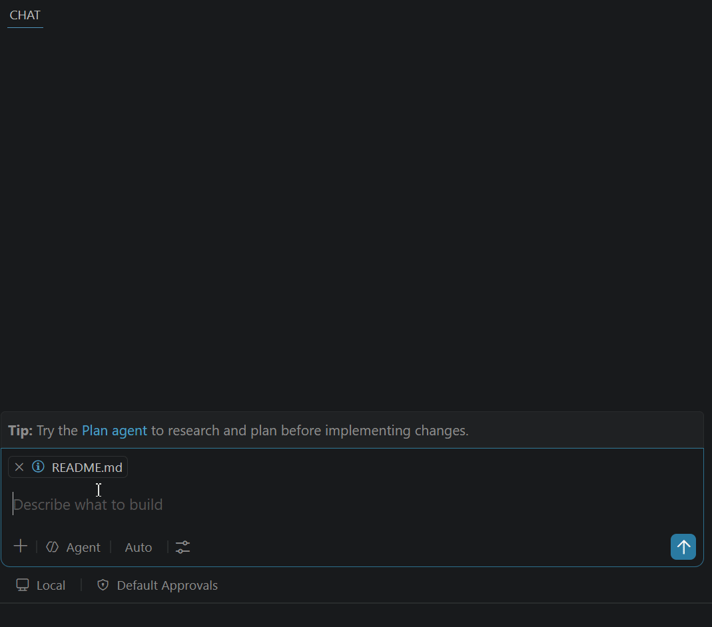

# 🎾 Hawkeye Agent

**The indisputable, high-precision line-judge for your software supply chain.**

[](https://www.npmjs.com/package/oss-hawkeye-agent)
[](https://github.com/ryanHwH20/oss-hawkeye-agent/blob/main/LICENSE)
[](https://github.com/ryanHwH20/oss-hawkeye-agent/actions)
[](https://scorecard.dev/viewer/?uri=github.com/ryanHwH20/oss-hawkeye-agent)
[](http://makeapullrequest.com)

In professional tennis, the Hawk-Eye system provides millimeter-accurate, indisputable judgments on whether a ball is in or out. In the modern software supply chain, developers need an equally authoritative system to judge whether an open-source dependency is "safe to use" or "out of bounds."

**Hawkeye Agent** is an enterprise-grade, AI-native security guardrail that evaluates open-source packages in milliseconds. It gives you a definitive verdict on license compliance, known vulnerabilities (CVE/CVSS), OpenSSF Scorecard health, and deep transitive dependencies (SBOM).

When Hawkeye calls a package **"OUT"**, it doesn't just block — it provides immediate, AI-guided automated remediation so you can keep moving.

---

## ✨ Features

- 🎾 **Millimeter-Accurate Line Calling** — Blocks high-risk vulnerabilities and non-compliant licenses instantly, returning standard exit codes (`0`/`1`).
- 🗣️ **Ask-First Security Workflow** — Developers ask in natural language, and Hawkeye returns one integrated audit report with policy verdict + remediation guidance.
- 🔍 **Deep SBOM Transitive Scanning** — Analyzes full dependency graphs via [deps.dev](https://deps.dev) to catch "shadow vulnerabilities" that standard manifest scanners miss.
- 💡 **AI-Powered Remediation** — When a package is blocked, Hawkeye generates upgrade snippets, `overrides` blocks, or delegates to your AI assistant to recommend compliant alternatives dynamically.
- 🤖 **Skill-Driven Workflow** — Works with workspace skills and local CLI execution so your AI assistant can enforce security checks before install actions.
- 🌐 **7 Ecosystems** — NPM, PyPI, Cargo, Go, RubyGems, NuGet, Maven — all from a single tool.
- 🏛️ **Policy-as-Code** — Drop a `.audit-agent.yaml` into your repo to enforce organization-specific compliance rules.

---

## ✅ Requirements

Before setup, make sure your local environment meets the following:

- Node.js 18+ (Node.js 20+ recommended)
- npm 9+
- Internet access to `https://api.osv.dev`
- Internet access to `https://api.deps.dev`
- Internet access to `https://osv.dev`
- Internet access to `https://deps.dev`
- VS Code with Copilot Chat (for conversational skill workflow)

---

## 🚀 Quick Start

### 1. Build from Source

Run Hawkeye from source by cloning the repository:

```bash
git clone https://github.com/ryanHwH20/oss-hawkeye-agent.git
cd oss-hawkeye-agent
npm install
npm run build
```

### 2. One-Time Developer Setup (Recommended)

To make new Copilot sessions consistently use Hawkeye Skill + CLI SOP, complete this once per machine:

1. Build the project:

```bash
npm install
npm run build
```

2. Keep workspace skill and instructions files in place:
- `.github/skills/hawkeye-agent/SKILL.md`
- `.github/copilot-instructions.md`

3. Reload VS Code window.

4. Run setup checks from project root:

```bash
npm run check:setup
npm run check:smoke
```

If both pass, new sessions should reliably trigger Hawkeye flow on install commands.

### 3. Single Package Audit (CLI)

You can run the built CLI directly to get a full enterprise-grade security report:

```bash
node dist/cli.js NPM express 4.16.0
node dist/cli.js PYPI requests 2.31.0
node dist/cli.js MAVEN org.springframework.boot:spring-boot 3.5.8
```

### Example Output

```
# Package Audit: express@4.16.0 (NPM)

> ### ❌ BLOCKED — Security Policy Violation

## Quick Reference
| Category         | Status                          |
| :---             | :---                            |
| 📜 License       | ✅ MIT — Compliant              |
| 🐛 Vulnerabilities | ❌ 2 Vulns (1 High)           |
| 📊 OpenSSF Scorecard | 🟢 7.5/10                  |

## 🚀 Automated Remediation
> 💡 Official patches are available. Upgrade to `4.21.2`:
npm install express@4.21.2
```

---

## 🤖 Skill + CLI Integration

Hawkeye is designed to run as a local CLI auditor while AI assistant behavior is controlled by workspace skill instructions.

### CLI Commands

Use the built CLI directly for deterministic security checks:

```bash
node dist/cli.js NPM lodash
node dist/cli.js PYPI requests 2.31.0
node dist/cli.js GO github.com/gin-gonic/gin
```

### 💬 Conversational UX & The Two-Step Guardrail

Once connected, keep your workspace skill at [.github/skills/hawkeye-agent/SKILL.md](.github/skills/hawkeye-agent/SKILL.md). This transforms your LLM into **Hawkeye**, an enterprise-grade security expert.

### Demo GIF (Question -> Integrated Report)

The demo below shows the signature experience: ask a question, get one integrated security report.



Hawkeye's primary interaction model is a **two-step conversational guardrail** built for real developer conversations:

1. **Step 1: Intercept & Audit:** When you attempt to install a package or ask about it, Hawkeye intercepts the intent, runs the CLI audit flow, and returns a comprehensive security report. **It will not install the package yet.**
2. **Step 2: Approve & Execute:** If the package is approved, simply repeat the command or tell Hawkeye to "go ahead." Hawkeye will recognize the package is safe and actually execute the installation.

### Why This Is the Signature Experience

Most tools require developers to stitch together multiple outputs. Hawkeye is optimized for one question to one integrated report:

- Single response that combines license, vulnerabilities, scorecard, SBOM, policy verdict, and remediation
- Clear pass/block decision before any install action proceeds
- Natural-language interaction that still remains deterministic via CLI-backed checks

### Example Conversation Flow

```text
Developer: Is lodash safe for our project?
Hawkeye: [returns full integrated audit report]

Developer: npm install lodash
Hawkeye: Choose mode -> (1) Security report first (2) Direct install now

Developer: 1
Hawkeye: [returns full integrated audit report with policy verdict and remediation]
```

**You can ask Hawkeye to:**
- **Audit before install:** `npm install express`
- **Check package security:** "Is lodash safe?", "Are there any vulnerabilities in requests?"
- **Inquire about licensing:** "What is the license of this package?", "Can we use GPL packages?"
- **Find secure alternatives:** "What are the safe alternatives to moment?"
- **Check enterprise policy:** "What is the company's open source policy?"

---

## 🏛️ Policy Configuration

Hawkeye uses a `.audit-agent.yaml` file in the working directory to enforce compliance. If none is found, it falls back to the built-in `policy.json`.

```yaml
policy:
  organizationName: "Your Organization"
  blockedLicenses:
    - "GPL-2.0-only"
    - "GPL-3.0-only"
    - "AGPL-3.0-only"
    - "SSPL-1.0"
    - "BUSL-1.1"
  minScorecardScore: 4.0
  blockVulnerabilities: true
  blockDeprecated: true
  exceptionFormUrl: "https://your-org.com/oss-exception-request"
```

---

## 🗺️ Roadmap

We're building Hawkeye Agent into the definitive shift-left security tool for developers. Here's where we're headed:

### ✅ Shipped (v1.0)

- [x] Single package audit across 7 ecosystems (NPM, PyPI, Go, Cargo, Maven, NuGet, RubyGems)
- [x] Batch command parsing (`npm install lodash express`)
- [x] License compliance checking with configurable blocklists
- [x] CVE vulnerability scanning via [OSV.dev](https://osv.dev)
- [x] OpenSSF Scorecard integration with severity-weighted analysis
- [x] Deep SBOM transitive dependency scanning
- [x] Skill-guided CLI workflow for package audits and command checks
- [x] AI Skill Prompt (`SKILL.md`) with loop prevention and dynamic alternative recommendations
- [x] Conversational two-step guardrail (ask -> integrated report -> approve/install)
- [x] Automated remediation snippets (upgrade paths, overrides, AI-guided alternatives)
- [x] CLI with standard exit codes
- [x] Policy-as-Code via `.audit-agent.yaml`
- [x] Publish to NPM (`oss-hawkeye-agent@1.0.2`)
- [x] In-memory caching layer with TTL for API responses
- [x] Setup and smoke checks (`check:setup`, `check:smoke`)

### 🔜 Next Up

- [ ] **AI Install Enforcement Gate** — When AI attempts any package install command, it must pass Hawkeye audit first (or explicitly choose guarded bypass), then proceed to execution.
- [ ] **`--json` and `--sarif` output** — Machine-readable formats for toolchain integration
- [ ] **Comprehensive test suite** — Vitest + mocked API responses for contributor confidence

### 🔮 Future

- [ ] **`hawkeye scan` command** — Auto-detect and audit entire project manifests (`package.json`, `requirements.txt`, `go.mod`, `Cargo.toml`, `pom.xml`)
- [ ] **Official GitHub Action** — `uses: ryanHwH20/hawkeye-action@v1` with PR comment bot
- [ ] **VS Code Extension** — Inline diagnostics and hover tooltips for risky dependencies
- [ ] **HTML report export** — Beautiful, shareable security reports (like Lighthouse)
- [ ] **Plugin system** — Custom policy rules (e.g., "block packages with <100 weekly downloads")
- [ ] **Shared policy registry** — Community-maintained templates (`fintech-strict`, `startup-relaxed`)

> 💡 **Have an idea?** [Open an issue](https://github.com/ryanHwH20/oss-hawkeye-agent/issues) or submit a PR — contributions are welcome!

---

## 🏆 Why Hawkeye?

| Capability | Hawkeye | Snyk | Socket | npm audit | OSV-Scanner |
| :--- | :---: | :---: | :---: | :---: | :---: |
| License Scanning | ✅ | ✅ | ✅ | ❌ | ❌ |
| Vulnerability Scanning | ✅ | ✅ | ✅ | ✅ | ✅ |
| SBOM Analysis | ✅ | ✅ | ✅ | ❌ | ❌ |
| OpenSSF Scorecard | ✅ | ❌ | ❌ | ❌ | ❌ |
| AI-Native (Skill + CLI) | ✅ ⭐ | ❌ | ❌ | ❌ | ❌ |
| Policy-as-Code | ✅ | ✅ | ✅ | ❌ | ❌ |
| Free & Open Source | ✅ | Freemium | Freemium | ✅ | ✅ |

> **Hawkeye's unique advantage:** It combines skill-guided AI behavior with deterministic local CLI checks, giving teams consistent, auditable package decisions right inside the IDE conversation.

---

## 🤝 Contributing

We welcome contributions! See [CONTRIBUTING.md](CONTRIBUTING.md) for guidelines.

## 📄 License

[Apache-2.0](LICENSE)

---

*Hawkeye Agent: The indisputable, high-precision line-judge for your software supply chain.* 🎾
