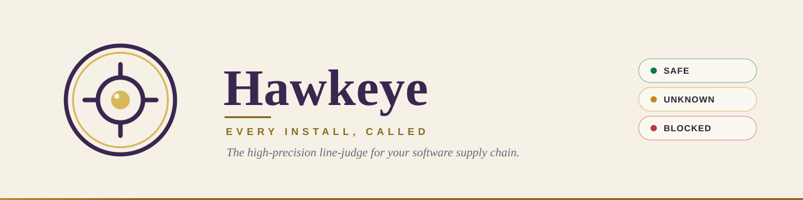

<p align="center">
  <picture>
    <source media="(prefers-color-scheme: dark)" srcset="assets/banner-dark.svg">
    
  </picture>
</p>

# Hawkeye Agent

**The indisputable, high-precision line-judge for your software supply chain.**

[](https://www.npmjs.com/package/oss-hawkeye-agent)
[](https://github.com/ryanHwH20/oss-hawkeye-agent/blob/main/LICENSE)
[](https://github.com/ryanHwH20/oss-hawkeye-agent/actions)
[](https://scorecard.dev/viewer/?uri=github.com/ryanHwH20/oss-hawkeye-agent)
[](http://makeapullrequest.com)

In professional tennis, the Hawk-Eye system provides millimeter-accurate, indisputable judgments on whether a ball is in or out. In the modern software supply chain, developers need an equally authoritative system to judge whether an open-source dependency is "safe to use" or "out of bounds."

**Hawkeye Agent** is an enterprise-grade, AI-native security guardrail that evaluates open-source packages in milliseconds. It gives you a definitive verdict on license compliance, known vulnerabilities (CVE/CVSS), OpenSSF Scorecard health, and deep transitive dependencies (SBOM).

When Hawkeye calls a package **"OUT"**, it doesn't just block — it provides immediate, AI-guided automated remediation so you can keep moving.

---

## ✨ Features

- 🎾 **Millimeter-Accurate Line Calling** — Blocks high-risk vulnerabilities and non-compliant licenses instantly, returning standard exit codes (`0`/`1`).
- 🗣️ **Ask-First Security Workflow** — Developers ask in natural language, and Hawkeye returns one integrated audit report with policy verdict + remediation guidance.
- 🔍 **Deep SBOM Transitive Scanning** — Analyzes full dependency graphs via [deps.dev](https://deps.dev) to catch "shadow vulnerabilities" that standard manifest scanners miss.
- 💡 **AI-Powered Remediation** — When a package is blocked, Hawkeye generates upgrade snippets, `overrides` blocks, or delegates to your AI assistant to recommend compliant alternatives dynamically.
- 🤖 **Skill-Driven Workflow** — Works with workspace skills and local CLI execution so your AI assistant can enforce security checks before install actions.
- 🌐 **7 Ecosystems** — NPM, PyPI, Cargo, Go, RubyGems, NuGet, Maven — all from a single tool.
- 🏛️ **Policy-as-Code** — Drop a `.audit-agent.yaml` into your repo to enforce organization-specific compliance rules.

---

## ✅ Requirements

Before setup, make sure your local environment meets the following:

- Node.js 18+ (Node.js 20+ recommended)
- npm 9+
- Internet access to `https://api.osv.dev`
- Internet access to `https://api.deps.dev`
- Internet access to `https://osv.dev`
- Internet access to `https://deps.dev`
- VS Code with Copilot Chat (for conversational skill workflow)

---

## 🚀 Quick Start

### 1. Build from Source

Run Hawkeye from source by cloning the repository:

```bash
git clone https://github.com/ryanHwH20/oss-hawkeye-agent.git
cd oss-hawkeye-agent
npm install
npm run build
```

### 2. One-Time Developer Setup (Recommended)

To make new Copilot sessions consistently use Hawkeye Skill + CLI SOP, complete this once per machine:

1. Build the project:

```bash
npm install
npm run build
```

2. Keep workspace skill and instructions files in place:
- `.github/skills/hawkeye-agent/SKILL.md`
- `.github/copilot-instructions.md`

3. Reload VS Code window.

4. Run setup checks from project root:

```bash
npm run check:setup
npm run check:smoke
```

If both pass, new sessions should reliably trigger Hawkeye flow on install commands.

### 3. Single Package Audit (CLI)

You can run the built CLI directly to get a full enterprise-grade security report:

```bash
node dist/cli.js NPM express 4.16.0
node dist/cli.js PYPI requests 2.31.0
node dist/cli.js MAVEN org.springframework.boot:spring-boot 3.5.8
```

### Example Output

```
# Package Audit: express@4.16.0 (NPM)

> ### ❌ BLOCKED — Security Policy Violation

## Quick Reference
| Category         | Status                          |
| :---             | :---                            |
| 📜 License       | ✅ MIT — Compliant              |
| 🐛 Vulnerabilities | ❌ 2 Vulns (1 High)           |
| 📊 OpenSSF Scorecard | 🟢 7.5/10                  |

## 🚀 Automated Remediation
> 💡 Official patches are available. Upgrade to `4.21.2`:
npm install express@4.21.2
```

### Machine-Readable Output & CI

For pipelines, emit structured output instead of the Markdown report:

```bash
node dist/cli.js NPM express 4.16.0 --json    # structured CheckResult
node dist/cli.js NPM express 4.16.0 --sarif   # SARIF 2.1.0 for GitHub Code Scanning
```

Exit codes are deterministic, so a CI gate is a one-liner:

- `0` — passed
- `1` — blocked by policy **or** unverifiable (fail-closed)
- `2` — the tool itself failed to run (usage / unexpected error)

```yaml
# .github/workflows/security.yml (example)
- name: Audit a dependency with Hawkeye
  run: node dist/cli.js NPM express 4.16.0 --sarif > hawkeye.sarif
- name: Upload to GitHub Code Scanning
  uses: github/codeql-action/upload-sarif@v3
  with:
    sarif_file: hawkeye.sarif
```

> When a data source is unreachable, Hawkeye **fails closed** (exit `1`) rather than reporting a package as clean — so a CI gate never green-lights an unverifiable package.

### Gate AI-Agent Installs (PreToolUse hook)

`check-command` audits the package(s) a shell command would install, so an AI coding agent can be **blocked** before it adds a risky dependency:

```bash
hawkeye check-command "npm install express@4.16.0"   # exit 0 pass / 1 blocked / 2 error
```

The result leads with a decision-first **Install Plan** — a one-page table plus a single copy-paste **safe install command** that pins every fixable package to a verified-clean version. Packages no version swap can rescue are listed separately, so the command never silently ships something unsafe:

```markdown
## Install Plan

| Package | Requested | Result | Fix | Reason |
| :-- | :-- | :-- | :-- | :-- |
| `axios` | `1.7.2` | ❌ Blocked | → `1.16.0` | Known Vulnerability ≥ MEDIUM |
| `lodash` | `4.17.21` | ❌ Blocked | → `4.18.0` | Known Vulnerability ≥ MEDIUM |

## ✅ Safe install command

​```bash
npm install axios@1.16.0 lodash@4.18.0
​```
```

Wire the shipped [Claude Code adapter](adapters/claude-code.mjs) into `~/.claude/settings.json` and the agent literally can't run a blocked `npm install` — a true gate, not a prompt nudge. See **[docs/INTEGRATIONS.md](docs/INTEGRATIONS.md)** (also covers a tool-agnostic shell shim, and the shared `adapters/` architecture other AI tools plug into).

### Whole-Project Scan

Audit every dependency declared in a project's manifests in one go:

```bash
node dist/cli.js scan .            # scan the current directory
node dist/cli.js scan ./my-app    # scan a specific path
node dist/cli.js scan . --sarif > hawkeye.sarif
```

`scan` auto-detects `package.json` (NPM) and `requirements.txt` (PyPI), audits each dependency, and returns an aggregated verdict with the same fail-closed exit codes (`0` / `1` / `2`). `--json` and `--sarif` work here too. When a `package-lock.json` (or `npm-shrinkwrap.json`) is present it is preferred, so Hawkeye audits the **resolved** versions npm will actually install — not the declared range.

### Baseline: fail CI only on *new* risk

A brand-new gate on an existing codebase lights up every pre-existing issue at once — noise that trains teams to ignore it. A **baseline** snapshots today's known risks so CI only fails on what a change *introduces*:

```bash
node dist/cli.js baseline .        # snapshot current risks → hawkeye-baseline.json (commit it)
node dist/cli.js scan . --baseline # in CI: pass unless a NEW risk appears
```

The scan then reports a **delta** — new risks up front (the only thing that fails the build), pre-existing ones collapsed into a "known" count and never re-alerted. Bump a baselined package to a new vulnerable version, or add a new risky dependency, and it surfaces as new. When you've triaged and accepted the current state, re-run `baseline .` to move the line.

> A baseline is **not** an approval. Every risk stays real and reported — the baseline only silences *re-alerting* on known ones. To actually approve a package (treat it as SAFE, with a reason and approver), use a committed [`.hawkeye-exceptions.yaml`](docs/INTEGRATIONS.md) instead.

### GitHub Action + PR comment bot

Run Hawkeye on every pull request: it scans the project, **uploads SARIF** to
GitHub code scanning, and posts a **sticky PR comment** (updated in place on each
push) with the verdict. It fails closed by default.

```yaml
# .github/workflows/hawkeye.yml
name: Hawkeye
on: [pull_request]
permissions:
  contents: read
  pull-requests: write      # post the PR comment
  security-events: write    # upload SARIF
jobs:
  scan:
    runs-on: ubuntu-latest
    steps:
      - uses: actions/checkout@v4
      - uses: ryanHwH20/oss-hawkeye-agent@v1
        with:
          path: .
          comment: 'true'         # sticky PR comment (default true)
          upload-sarif: 'true'    # GitHub code scanning (default true)
          fail-on-block: 'true'   # fail the job when BLOCKED/UNVERIFIED (default true)
```

The comment renders as a `scan` summary — e.g. `hawkeye scan . --comment` locally
produces the same Markdown.

---

## 🤖 Skill + CLI Integration

Hawkeye is designed to run as a local CLI auditor while AI assistant behavior is controlled by workspace skill instructions.

### CLI Commands

Use the built CLI directly for deterministic security checks:

```bash
node dist/cli.js NPM lodash
node dist/cli.js PYPI requests 2.31.0
node dist/cli.js GO github.com/gin-gonic/gin
```

### Agent-facing API (schema v1)

An integration should not have to reverse-engineer CLI prose to decide what an
agent may do next. `assessAction()` returns one versioned, machine-actionable
contract for every agent surface:

```ts
import { assessAction } from 'oss-hawkeye-agent';

const assessment = await assessAction({
  kind: 'shell_command',
  command: 'npm install lodash@4.17.20',
  cwd: process.cwd(),
});
```

Applicable install actions return an `AdmissionDecision` with raw and effective
verdicts, structured findings and evidence references, policy identity,
governed overrides, verified remediation, and one deterministic next action.
Commands outside the supported install surface return `not_applicable` rather
than claiming a security `SAFE` verdict. See [Agent Harness Architecture](docs/AGENT-HARNESS.md).

Integrations that need the package-level trust boundary can use the Decision
Kernel directly:

```ts
import {
  collectPackageEvidence,
  evaluatePackage,
  loadPolicy,
} from 'oss-hawkeye-agent';

const evidence = await collectPackageEvidence({
  system: 'PYPI',
  name: 'requests',
  version: '2.32.3',
});
const result = evaluatePackage(evidence, loadPolicy());
```

Long-running agent integrations can preserve and resume the decision workflow:

```ts
import { createRun, nextAction, submitResult } from 'oss-hawkeye-agent';

const state = createRun(intent, policyRef, { runId: 'run-123' });
const action = nextAction(state);
const updated = submitResult(state, action.id, actionResult);
```

The versioned state records bounded attempts and action history without storing
conversation or hidden model state. Only the expected action result can advance
the workflow; approval requests never let an agent approve itself. The Harness
does not execute commands—normal Hawkeye enforcement remains authoritative.
See [Agent Harness Architecture](docs/AGENT-HARNESS.md) and the
[PR3 maintainer UAT](docs/UAT-PR3.md).

### `@oss-hawkeye` in VS Code Chat

The VS Code adapter exposes Hawkeye as an explicit chat participant while
keeping security decisions in the same Runtime and Harness:

```text
@oss-hawkeye /check npm install axios@1.7.2
@oss-hawkeye /status
@oss-hawkeye /explain
@oss-hawkeye /fix
@oss-hawkeye /policy
@oss-hawkeye /scan
```

`@oss-hawkeye` selects the security participant; slash commands select a
specific operation. The participant never executes an install or creates an
approval. Build a locally installable VSIX with `npm run package:vscode`, and
see the [PR4 maintainer UAT](docs/UAT-PR4.md) for installation and rollback.

Collection owns network and cache access. Evaluation is deterministic and
side-effect free, so the same evidence can be replayed against a changed policy
without asking upstream providers again.

### 💬 Conversational UX & The Two-Step Guardrail

Once connected, keep your workspace skill at [.github/skills/hawkeye-agent/SKILL.md](.github/skills/hawkeye-agent/SKILL.md). It teaches the assistant when and how to invoke Hawkeye; the LLM does not become the authority that declares a package safe.

### Demo GIF (Question -> Integrated Report)

The demo below shows the signature experience: ask a question, get one integrated security report.


Hawkeye's primary interaction model is a **two-step conversational guardrail** built for real developer conversations:

1. **Step 1: Intercept & Audit:** When you attempt to install a package or ask about it, Hawkeye intercepts the intent, runs the CLI audit flow, and returns a comprehensive security report. **It will not install the package yet.**
2. **Step 2: Approve & Execute:** If the package is approved, simply repeat the command or tell Hawkeye to "go ahead." Hawkeye will recognize the package is safe and actually execute the installation.

### Why This Is the Signature Experience

Most tools require developers to stitch together multiple outputs. Hawkeye is optimized for one question to one integrated report:

- Single response that combines license, vulnerabilities, scorecard, SBOM, policy verdict, and remediation
- Clear pass/block decision before any install action proceeds
- Natural-language interaction that still remains deterministic via CLI-backed checks

### Example Conversation Flow

```text
Developer: Is lodash safe for our project?
Hawkeye: [returns full integrated audit report]

Developer: npm install lodash
Hawkeye: Choose mode -> (1) Security report first (2) Direct install now

Developer: 1
Hawkeye: [returns full integrated audit report with policy verdict and remediation]
```

**You can ask Hawkeye to:**
- **Audit before install:** `npm install express`
- **Check package security:** "Is lodash safe?", "Are there any vulnerabilities in requests?"
- **Inquire about licensing:** "What is the license of this package?", "Can we use GPL packages?"
- **Find secure alternatives:** "What are the safe alternatives to moment?"
- **Check enterprise policy:** "What is the company's open source policy?"

---

## 🏛️ Policy Configuration

Hawkeye uses a `.audit-agent.yaml` file in the working directory to enforce compliance. If none is found, it falls back to the built-in `policy.json`.

```yaml
policy:
  organizationName: "Your Organization"
  blockedLicenses:
    - "GPL-2.0-only"
    - "GPL-3.0-only"
    - "AGPL-3.0-only"
    - "SSPL-1.0"
    - "BUSL-1.1"
  minScorecardScore: 4.0
  blockVulnerabilities: true
  minBlockingSeverity: "MEDIUM"   # CRITICAL | HIGH | MEDIUM | LOW — lowest severity that blocks (default MEDIUM)
  blockDeprecated: true
  blockTyposquats: true            # block names that look like a typosquat of a popular package (default true)
  exceptionFormUrl: "https://your-org.com/oss-exception-request"
```

---

## 🗺️ Roadmap

Our strategy and positioning live in **[docs/VISION.md](docs/VISION.md)**; the live, issue-linked roadmap is in **[docs/ROADMAP.md](docs/ROADMAP.md)**; the engineering arc and measured outcomes are in **[docs/STRATEGY.md](docs/STRATEGY.md)**. At a glance:

| Milestone | Focus | Status |
| :--- | :--- | :--- |
| **v1.1 — Trustworthy Core** | Fail-closed `SAFE` / `BLOCKED` / `UNKNOWN` verdict, request timeouts + retries, distinct exit codes, bounded concurrency + OSV batching | ✅ Shipped |
| **v1.x — CI-Ready Integration** | `--json` / `--sarif` output, SPDX-aware license matching, configurable severity threshold, `hawkeye scan` (lockfile-aware), official GitHub Action + PR comment bot | ✅ Shipped |
| **v1.2 — AI-Agent Guardrail** | Enforced install gate (PreToolUse hook), self-correcting remediation, governed git-provenanced exceptions + telemetry, malware / typosquat detection, cross-process cache + resident daemon | ✅ Shipped |
| **Next** | MCP enforcement gate, AI-assisted remediation PRs, shared policy registry, broader lockfile/ecosystem coverage, cross-org learning loop | 🔮 Planned |

> 💡 **Have an idea?** [Open an issue](https://github.com/ryanHwH20/oss-hawkeye-agent/issues) or submit a PR — contributions are welcome!

---

## 🏆 Why Hawkeye?

| Capability | Hawkeye | Snyk | Socket | npm audit | OSV-Scanner |
| :--- | :---: | :---: | :---: | :---: | :---: |
| License Scanning | ✅ | ✅ | ✅ | ❌ | ❌ |
| Vulnerability Scanning | ✅ | ✅ | ✅ | ✅ | ✅ |
| SBOM Analysis | ✅ | ✅ | ✅ | ❌ | ❌ |
| OpenSSF Scorecard | ✅ | ❌ | ❌ | ❌ | ❌ |
| AI-Native (Skill + CLI) | ✅ ⭐ | ❌ | ❌ | ❌ | ❌ |
| Policy-as-Code | ✅ | ✅ | ✅ | ❌ | ❌ |
| Free & Open Source | ✅ | Freemium | Freemium | ✅ | ✅ |

> **Hawkeye's unique advantage:** It combines skill-guided AI behavior with deterministic local CLI checks, giving teams consistent, auditable package decisions right inside the IDE conversation.

---

## 🤝 Contributing

We welcome contributions! See [CONTRIBUTING.md](CONTRIBUTING.md) for guidelines.

## 📄 License

[Apache-2.0](LICENSE)

---

*Hawkeye Agent: The indisputable, high-precision line-judge for your software supply chain.* 🎾
